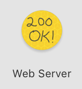
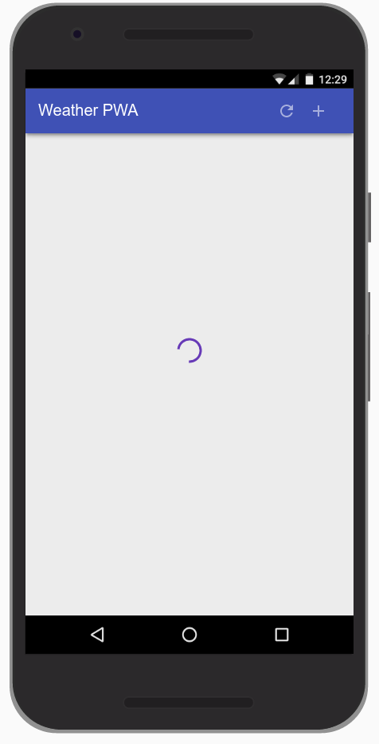
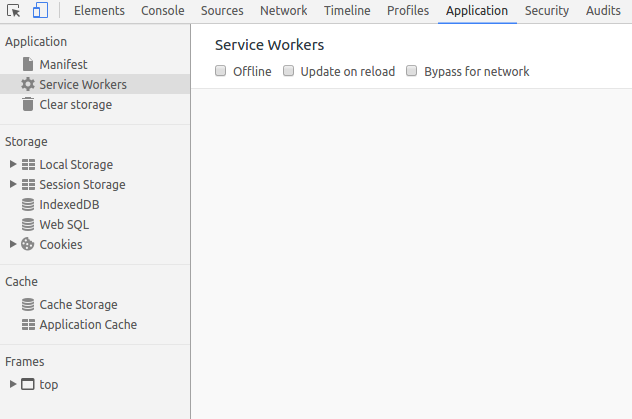
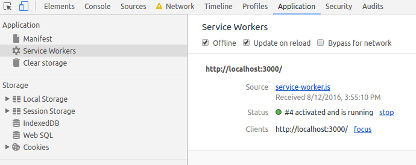

# Codelabを利用した教材の作り方

[Codelab Feedback](https://github.com/bcts369dojo/info/issues)


## はじめに


このガイドは、 [Google Codelabs](https://codelabs.developers.google.com/)を使用した教材の作り方を簡単に説明するガイドです。出来上がった教材は素晴らしいものの、作るまでの過程が特種なので、結構戸惑います。このガイドが助けになればなによりです。

### **必要な情報へのリンク**

*  [Codelab Formatting Guide (External)](https://docs.google.com/document/d/18dnMdUJQaGKY1Tit_-fO1YOpOpAbA4hh0YDXQlCEjvA/edit)
*  [googlecodelabs/tools: Codelabs management & hosting tools](https://github.com/googlecodelabs/tools)
*  [tools/FORMAT-GUIDE.md at master · googlecodelabs/tools](https://github.com/googlecodelabs/tools/blob/master/FORMAT-GUIDE.md)
*  [Tutorial how to make tutorials using Google Code Labs. Gangnam style.](https://medium.com/@mariopce/tutorial-how-to-make-tutorials-using-google-code-labs-gangdam-style-d62b35476816)

### **Google Codelabsについて**

Google CodelabsはA Progressive Web App is:

* **Progressive** - Works for every user, regardless of browser choice because it's built with progressive enhancement as a core tenet.
* **Responsive** - Fits any form factor: desktop, mobile, tablet, or whatever is next.
* **Connectivity independent** - Enhanced with service workers to work offline or on low-quality networks.
* **App-like** - Feels like an app, because the app shell model separates the application  *functionality*  from application  *content* .
* **Fresh** - Always up-to-date thanks to the  [service worker](https://developers.google.com/web/fundamentals/getting-started/primers/service-workers) update process.
* **Safe** - Served via HTTPS to prevent snooping and to ensure content hasn't been tampered with.
* **Re-engageable** - Makes re-engagement easy through features like push notifications.

[](https://chrome.google.com/webstore/detail/web-server-for-chrome/ofhbbkphhbklhfoeikjpcbhemlocgigb?hl=en)

<aside class="special">

もっと知りたい場合は [こちら](https://codelabs.developers.google.com/)をご覧ください。
</aside>

### **What you will build**

### **What you'll learn**

* How to design and construct an app using the "app shell" method
* How to make your app work offline
* How to store data for later offline use

```
var dataCacheName = 'weatherData-v1';
```


## セットアップ


### **Download the Code**

Click the following link to download all the code for this codelab:

[](https://github.com/googlecodelabs/your-first-pwapp/archive/master.zip)

Unpack the downloaded zip file. This will unpack a root folder (`your-first-pwapp-master`), which contains one folder for each step of this codelab, along with all of the resources you will need.

The `step-NN` folders contain the desired end state of each step of this codelab. They are there for reference. We'll be doing all our coding work in a directory called `work`.

### **Install and verify web server**

While you're free to use your own web server, this codelab is designed to work well with the Chrome Web Server. If you don't have that app installed yet, you can install it from the Chrome Web Store.

[](https://chrome.google.com/webstore/detail/web-server-for-chrome/ofhbbkphhbklhfoeikjpcbhemlocgigb?hl=en)

After installing the Web Server for Chrome app, click on the Apps shortcut on the bookmarks bar:


<aside class="special">

More help:  [Add and open Chrome apps](https://support.google.com/chrome_webstore/answer/3060053)
</aside>

In the ensuing window, click on the Web Server icon:



You'll see this dialog next, which allows you to configure your local web server:


Click the **choose folder** button, and select the `work` folder. This will enable you to serve your work in progress via the URL highlighted in the web server dialog (in the **Web Server URL(s)** section).

Under Options, check the box next to "Automatically show index.html", as shown below:


Then stop and restart the server by sliding the toggle labeled "Web Server: STARTED" to the left and then back to the right.


Now visit your work site in your web browser (by clicking on the highlighted Web Server URL) and you should see a page that looks like this:



This app is not yet doing anything interesting - so far, it's just a minimal skeleton with a spinner we're using to verify your web server functionality. We'll add functionality and UI features in subsequent steps.

<aside class="special">

From this point forward, all testing/verification (e.g. the** Test It Out** sections in subsequent steps) should be performed using this web server setup.
</aside>


## Architect your App Shell


### **What is the app shell?**

The app's shell is the minimal HTML, CSS, and JavaScript that is required to power the user interface of a progressive web app and is one of the components that ensures reliably good performance. Its first load should be extremely quick and immediately cached. "Cached" means that the shell files are loaded once over the network and then saved to the local device. Every subsequent time that the user opens the app, the shell files are loaded from the local device's cache, which results in blazing-fast startup times.

App shell architecture separates the core application infrastructure and UI from the data. All of the UI and infrastructure is cached locally using a  [service worker](https://developers.google.com/web/fundamentals/getting-started/primers/service-workers) so that on subsequent loads, the Progressive Web App only needs to retrieve the necessary data, instead of having to load everything.

A  [service worker](https://developers.google.com/web/fundamentals/getting-started/primers/service-workers) is a script that your browser runs in the background, separate from a web page, opening the door to features that don't need a web page or user interaction.


Put another way, the app shell is similar to the bundle of code that you'd publish to an app store when building a native app. It is the core components necessary to get your app off the ground, but likely does not contain the data.

### **Why use the App Shell architecture?**

Using the app shell architecture allows you to focus on speed, giving your Progressive Web App similar properties to native apps: instant loading and regular updates, all without the need of an app store.

### **Design the App Shell **

The first step is to break the design down into its core components.

Ask yourself:

* What needs to be on screen immediately?
* What other UI components are key to our app?
* What supporting resources are needed for the app shell? For example images, JavaScript, styles, etc.

We're going to create a Weather app as our first Progressive Web App. The key components will consist of:

When designing a more complex app, content that isn't needed for the initial load can be requested later and then cached for future use. For example, we could defer the loading of the New City dialog until after we've rendered the first run experience and have some idle cycles available.


## Implement your App Shell


There are multiple ways to get started with any project, in this case, to keep our project as simple as possible and concentrate on Progressive Web Apps, we've provided you with all of the resources you'll need.

### **Create the HTML for the App Shell**

Now we'll add the core components we discussed in  [Architect the App Shell](https://developers.google.com/web/fundamentals/getting-started/codelabs/your-first-pwapp#architect_your_app_shell).

Remember, the key components will consist of:

* Header with a title, and add/refresh buttons
* Container for forecast cards
* A forecast card template
* A dialog for adding new cities
* A loading indicator

The `index.html` file that is already in your `work` directory should look something like this (this is a subset of the actual contents, don't copy this code into your file):

```
package main

func main() {
    fmt.Println("Hello")
}
```

Notice the loader is visible by default. This ensures that the user sees the loader immediately as the page loads, giving them a clear indication that the content is loading.

To save time, we've also already created the stylesheet for you to use.

<aside class="special">

We've given you the markup and styles to save you some time and make sure you're starting on a solid foundation. In the next section, you'll have an opportunity to write your own code.
</aside>

### **Check out the key JavaScript app code**

Now that we have most of the UI ready, it's time to start hooking up the code to make everything work. Like the rest of the app shell, be conscious about what code is necessary as part of the key experience and what can be loaded later.

Your work directory also already includes the app code (`scripts/app.js`), in it you'll find:

* An `app` object that contains some of the key information necessary for the app.
* The event listeners for all of the buttons in the header (`add/refresh`) and in the add city dialog (`add/cancel`).
* A method to add or update forecast cards (`app.updateForecastCard`).
* A method to get the latest weather forecast data from the Firebase Public Weather API (`app.getForecast`).
* A method to iterate the current cards and call `app.getForecast` to get the latest forecast data (`app.updateForecasts`).
* Some fake data (`initialWeatherForecast`) you can use to quickly test how things render.

### **Test it out**

Now that you've got the core HTML, styles and JavaScript, it's time to test the app.

To see how the fake weather data is rendered, uncomment the following line at the bottom of your `index.html` file:

    <!--<script src="scripts/app.js" async></script>-->

Next, uncomment the following line at the bottom of your `app.js` file:

    // app.updateForecastCard(initialWeatherForecast);

Reload your app. The result should be a nicely formatted (though fake, as you can tell by the date) forecast card with the spinner disabled, like this:


[](https://weather-pwa-sample.firebaseapp.com/step-04/)

Once you've tried it and verified it works as expected, you can remove the call to  `app.updateForecastCard` with the fake data again. We only needed it to ensure that everything worked as expected.


## Start with a fast first load


Progressive Web Apps should start fast and be usable immediately. In its current state, our Weather App starts quickly, but it's not useable. There's no data. We could make an AJAX request to get that data, but that results in an extra request and makes the initial load longer. Instead, provide real data in the first load.

### **Inject the weather forecast data**

For this code lab, we'll simulate the server injecting the weather forecast directly into the JavaScript, but in a production app, the latest weather forecast data would be injected by the server based on the IP address geo-location of the user.

The code already contains the data that we're going to inject. It's the `initialWeatherForecast` that we used in the previous step.

### **Differentiating the first run**

But, how do we know when to display this information, which may not be relevant on future loads when the weather app is pulled from the cache? When the user loads the app on subsequent visits, they may have changed cities, so we need to load the information for those cities, not necessarily the first city they ever looked up.

User preferences, like the list of cities a user has subscribed to, should be stored locally using IndexedDB or another fast storage mechanism. To simplify this code lab as much as possible, we've used  [localStorage](https://developer.mozilla.org/en-US/docs/Web/API/Window/localStorage), which is not ideal for production apps because it is a blocking, synchronous storage mechanism that is potentially very slow on some devices.

<aside class="special">

**Extra Credit**: Replace `localStorage` implementation with  [idb](https://www.npmjs.com/package/idb), check out  [localForage](https://github.com/localForage/localForage) as a simple wrapper to idb.
</aside>

First, let's add the code required to save user preferences. Find the following TODO comment in your code.

```
  // TODO add saveSelectedCities function here
```

And add the following code below the comment.

```
  // Save list of cities to localStorage.
  <HIGHLIGHT>app.saveSelectedCities = function() {</HIGHLIGHT>
    var selectedCities = JSON.stringify(app.selectedCities);
    localStorage.selectedCities = selectedCities;
  };
```

Next, let's add the startup code to check if the user has any saved cities and render those, or use the injected data. Find the following comment:

```
  // TODO add startup code here
```

And add the following code below this comment:

```
/************************************************************************
   *
   * Code required to start the app
   *
   * NOTE: To simplify this codelab, we've used localStorage.
   *   localStorage is a synchronous API and has serious performance
   *   implications. It should not be used in production applications!
   *   Instead, check out IDB (https://www.npmjs.com/package/idb) or
   *   SimpleDB (https://gist.github.com/inexorabletash/c8069c042b734519680c)
   ************************************************************************/

  app.selectedCities = localStorage.selectedCities;
  if (app.selectedCities) {
    app.selectedCities = JSON.parse(app.selectedCities);
    app.selectedCities.forEach(function(city) {
      app.getForecast(city.key, city.label);
    });
  } else {
    /* The user is using the app for the first time, or the user has not
     * saved any cities, so show the user some fake data. A real app in this
     * scenario could guess the user's location via IP lookup and then inject
     * that data into the page.
     */
    app.updateForecastCard(initialWeatherForecast);
    app.selectedCities = [
      {key: initialWeatherForecast.key, label: initialWeatherForecast.label}
    ];
    app.saveSelectedCities();
  }
```

The startup code checks if there are any cities saved in local storage. If so, then it parses the local storage data and then displays a forecast card for each of the saved cities. Else, the startup code just uses the fake forecast data and saves that as the default city.

### **Save the selected cities**

Finally, you need to modify the "add city" button handler to save the selected city to local storage.

Update your `butAddCity` click handler so that it matches the following code:

```
document.getElementById('butAddCity').addEventListener('click', function() {
    // Add the newly selected city
    var select = document.getElementById('selectCityToAdd');
    var selected = select.options[select.selectedIndex];
    var key = selected.value;
    var label = selected.textContent;
    if (!app.selectedCities) {
      app.selectedCities = [];
    }
    app.getForecast(key, label);
    app.selectedCities.push({key: key, label: label});
    app.saveSelectedCities();
    app.toggleAddDialog(false);
  });
```

The new additions are the initialization of `app.selectedCities` if it doesn't exist, and the calls to `app.selectedCities.push()` and `app.saveSelectedCities()`.

### **Test it out**

* When first run, your app should immediately show the user the forecast from `initialWeatherForecast`.
* Add a new city (by clicking the + icon on the upper right) and verify that two cards are shown.
* Refresh the browser and verify that the app loads both forecasts and shows the latest information.

[](https://weather-pwa-sample.firebaseapp.com/step-05/)


## Use service workers to pre-cache the App Shell


Progressive Web Apps have to be fast, and installable, which means that they work online, offline, and on intermittent, slow connections. To achieve this, we need to cache our app shell using service worker, so that it's always available quickly and reliably.

If you're unfamiliar with service workers, you can get a basic understanding by reading  [Introduction To Service Workers](https://developers.google.com/web/fundamentals/primers/service-worker/) about what they can do, how their lifecycle works and more. Once you've completed this code lab, be sure to check out the  [Debugging Service Workers code lab](http://goo.gl/jhXCBy) for a more indepth look at how to work with service workers.

Features provided via service workers should be considered a progressive enhancement, and added only if supported by the browser. For example, with service workers you can cache the app shell and data for your app, so that it's available even when the network isn't. When service workers aren't supported, the offline code isn't called, and the user gets a basic experience. Using feature detection to provide progressive enhancement has little overhead and it won't break in older browsers that don't support that feature.

<aside class="special">

**Remember**: Service worker functionality is only available on pages that are accessed via HTTPS (http://localhost and equivalents will also work, to facilitate testing). To learn about the rationale behind this restriction check out  [Prefer Secure Origins For Powerful New Features](http://www.chromium.org/Home/chromium-security/prefer-secure-origins-for-powerful-new-features) from the Chromium team.
</aside>

### **Register the service worker if it's available**

The first step to making the app work offline is to register a service worker, a script that allows background functionality without the need for an open web page or user interaction.

This takes two simple steps:

1. Tell the browser to register the JavaScript file as the service worker.
2. Create a JavaScript file containing the service worker.

First, we need to check if the browser supports service workers, and if it does, register the service worker. Add the following code to `app.js` (after the `// TODO add service worker code here` comment):

```
  if ('serviceWorker' in navigator) {
    navigator.serviceWorker
             .register('./service-worker.js')
             .then(function() { console.log('Service Worker Registered'); });
  }
```

### **Cache the site assets**

When the service worker is registered, an install event is triggered the first time the user visits the page. In this event handler, we will cache all the assets that are needed for the application.

<aside class="warning">

The code below must NOT be used in production, it covers only the most basic use cases and it's easy to get yourself into a state where your app shell will never update. Be sure to review the section below that discusses the pitfalls of this implementation and how to avoid them.
</aside>

When the service worker is fired, it should open the  [caches](https://developer.mozilla.org/en-US/docs/Web/API/Cache) object and populate it with the assets necessary to load the App Shell. Create a file called `service-worker.js` in your application root folder (which should be `your-first-pwapp-master/work` directory). This file must live in the application root because the scope for service workers is defined by the directory in which the file resides. Add this code to your new `service-worker.js` file:

```
var cacheName = 'weatherPWA-step-6-1';
var filesToCache = [];

self.addEventListener('install', function(e) {
  console.log('[ServiceWorker] Install');
  e.waitUntil(
    caches.open(cacheName).then(function(cache) {
      console.log('[ServiceWorker] Caching app shell');
      return cache.addAll(filesToCache);
    })
  );
});
```

First, we need to open the cache with `caches.open()` and provide a cache name. Providing a cache name allows us to version files, or separate data from the app shell so that we can easily update one but not affect the other.

Once the cache is open, we can then call `cache.addAll()`, which takes a list of URLs, then fetches them from the server and adds the response to the cache. Unfortunately, `cache.addAll()` is atomic, if any of the files fail, the entire cache step fails!

Alright, let's start getting familiar with how you can use DevTools to understand and debug service workers. Before reloading your page, open up DevTools, go the **Service Worker **pane on the **Application **panel. It should look like this.



When you see a blank page like this, it means that the currently open page does not have any registered service workers.

Now, reload your page. The Service Worker pane should now look like this.


When you see information like this, it means the page has a service worker running.

OK, now we're are going to take a brief detour and demonstrate a gotcha that you may encounter when developing service workers. To demonstrate, let's add an `activate` event listener below the `install` event listener in your `service-worker.js` file.

```
self.addEventListener('activate', function(e) {
  console.log('[ServiceWorker] Activate');
});
```

The `activate` event is fired when the service worker starts up.

Open up the DevTools Console and reload the page, switch to the Service Worker pane in the Application panel and click inspect on the activated service worker. You expect to see the `[ServiceWorker] Activate` message logged to the console, but it didn't happen. Check out your Service Worker pane and you can see that the new service worker (that includes the activate event listener) appears to be in a "waiting" state.


Basically, the old service worker continues to control the page as long as there is a tab open to the page. So, you  *could * close and re-open the page or press the **skipWaiting **button, but a longer-term solution is to just enable the **Update on Reload **checkbox on the Service Worker pane of DevTools. When this checkbox is enabled, the service worker is forcibly updated every time that the page reloads.

Enable the **update on reload **checkbox now and reload the page to confirm that the new service worker gets activated.

**Note:** You may see an error in the Service Worker pane of the Application panel similar to the one below, it's **safe** to ignore this error.


That's all for now regarding inspecting and debugging service workers in DevTools. We'll show you some more tricks later. Let's get back to building your app.

Let's expand on the `activate` event listener to include some logic to update the cache. Update your code to match the code below.

```
self.addEventListener('activate', function(e) {
  console.log('[ServiceWorker] Activate');
  e.waitUntil(
    caches.keys().then(function(keyList) {
      return Promise.all(keyList.map(function(key) {
        if (key !== cacheName) {
          console.log('[ServiceWorker] Removing old cache', key);
          return caches.delete(key);
        }
      }));
    })
  );
  return self.clients.claim();
});
```

This code ensures that your service worker updates its cache whenever any of the app shell files change. In order for this to work, you'd need to increment the `cacheName` variable at the top of your service worker file.

The last statement fixes a corner-case which you can read about in the (optional) information box below.

<aside class="special">

When the app is complete, `self.clients.claim()` fixes a corner case in which the app wasn't returning the latest data. You can reproduce the corner case by commenting out the line below and then doing the following steps: 1) load app for first time so that the initial New York City data is shown 2) press the refresh button on the app 3) go offline 4) reload the app. You expect to see the newer NYC data, but you actually see the initial data. This happens because the service worker is not yet activated. `self.clients.claim()` essentially lets you activate the service worker faster.
</aside>

Finally, let's update the list of files required for the app shell. In the array, we need to include all of the files our app needs, including images, JavaScript, stylesheets, etc. Near the top of your `service-worker.js` file, replace `var filesToCache = [];` with the code below:

```
var filesToCache = [
  '/',
  '/index.html',
  '/scripts/app.js',
  '/styles/inline.css',
  '/images/clear.png',
  '/images/cloudy-scattered-showers.png',
  '/images/cloudy.png',
  '/images/fog.png',
  '/images/ic_add_white_24px.svg',
  '/images/ic_refresh_white_24px.svg',
  '/images/partly-cloudy.png',
  '/images/rain.png',
  '/images/scattered-showers.png',
  '/images/sleet.png',
  '/images/snow.png',
  '/images/thunderstorm.png',
  '/images/wind.png'
];
```

<aside class="special">

Be sure to include all permutations of file names, for example our app is served from `index.html`, but it may also be requested as `/` since the server sends `index.html` when a root folder is requested. You could deal with this in the `fetch` method, but it would require special casing which may become complex.
</aside>

Our app doesn't work offline quite yet. We've cached the app shell components, but we still need to load them from the local cache.

### **Serve the app shell from the cache**

Service workers provide the ability to intercept requests made from our Progressive Web App and handle them within the service worker. That means we can determine how we want to handle the request and potentially serve our own cached response.

For example:

```
self.addEventListener('fetch', function(event) {
  // Do something interesting with the fetch here
});
```

Let's now serve the app shell from the cache. Add the following code to the bottom of your `service-worker.js` file:

```
self.addEventListener('fetch', function(e) {
  console.log('[ServiceWorker] Fetch', e.request.url);
  e.respondWith(
    caches.match(e.request).then(function(response) {
      return response || fetch(e.request);
    })
  );
});
```

Stepping from inside, out, `caches.match()` evaluates the web request that triggered the  [fetch](https://developer.mozilla.org/en-US/docs/Web/API/Fetch_API) event, and checks to see if it's available in the cache. It then either responds with the cached version, or uses `fetch` to get a copy from the network. The `response` is passed back to the web page with `e.respondWith()`.

<aside class="warning">

If you're not seeing the `[ServiceWorker]` logging in the console, be sure you've changed the `cacheName` variable and that you're inspecting the right service worker by opening the Service Worker pane in the Applications panel and clicking **inspect** on the running service worker. If that doesn't work, see the section on Tips for testing live service workers.
</aside>

### **Test it out**

Your app is now offline-capable! Let's try it out.

Reload your page and then go to the **Cache Storage** pane on the **Application** panel of DevTools. Right click **Cache Storage**, pick **Refresh Caches**, expand the section and you should see the name of your app shell cache listed on the left-hand side. When you click on your app shell cache you can see all of the resources that it has currently cached.


Now, let's test out offline mode. Go back to the **Service Worker** pane of DevTools and enable the **Offline** checkbox. After enabling it, you should see a little yellow warning icon next to the **Network** panel tab. This indicates that you're offline.



Reload your page and... it works! Kind of, at least. Notice how it loads the initial (fake) weather data.


Check out the `else` clause in `app.getForecast()` to understand why the app is able to load the fake data.

The next step is to modify the app and service worker logic to be able to cache weather data, and return the most recent data from the cache when the app is offline.

**Tip:** To start fresh and clear all saved data (`localStorage`, `indexedDB` data, cached files) and remove any service workers, use the Clear storage pane in the Application tab.

[](https://weather-pwa-sample.firebaseapp.com/step-06/)

### **Beware of the edge cases**

As previously mentioned, this code **must not be used in production** because of the many unhandled edge cases.

#### **Cache depends on updating the cache key for every change**

For example this caching method requires you to update the cache key every time content is changed, otherwise, the cache will not be updated, and the old content will be served. So be sure to change the cache key with every change as you're working on your project!

#### **Requires everything to be redownloaded for every change**

Another downside is that the entire cache is invalidated and needs to be re-downloaded every time a file changes. That means fixing a simple single character spelling mistake will invalidate the cache and require everything to be downloaded again. Not exactly efficient.

```
if (key !== cacheName && key !== dataCacheName) {
```

### **Test it out**

The app should be completely offline-functional now. Save a couple of cities and press the refresh button on the app to get fresh weather data, and then go offline and reload the page.

Then go to the **Cache Storage** pane on the **Application** panel of DevTools. Expand the section and you should see the name of your app shell and data cache listed on the left-hand side. Opening the data cache should should the data stored for each city.


[](https://weather-pwa-sample.firebaseapp.com/step-07/)


## Support native integration


Nobody likes to have to type in long URLs on a mobile keyboard if they don't need to. With the Add To home screen feature, your users can choose to add a shortcut link to their device just as they would install a native app from a store, but with a lot less friction.

Further Reading:

[Using app install banners](https://developers.google.com/web/fundamentals/engage-and-retain/simplified-app-installs/)

### **Add to Homescreen elements for Safari on iOS**

In your `index.html`, add the following to the bottom of the `<head>` element:

```
  <!-- Add to home screen for Safari on iOS -->
  <meta name="apple-mobile-web-app-capable" content="yes">
  <meta name="apple-mobile-web-app-status-bar-style" content="black">
  <meta name="apple-mobile-web-app-title" content="Weather PWA">
  <link rel="apple-touch-icon" href="images/icons/icon-152x152.png">
```

### **Tile Icon for Windows**

In your `index.html`, add the following to the bottom of the `<head>` element:

```
  <meta name="msapplication-TileImage" content="images/icons/icon-144x144.png">
  <meta name="msapplication-TileColor" content="#2F3BA2">
```

### **Test it out**

In this section we'll show you a couple of ways to test your web app manifest.

The first way is DevTools. Open up the **Manifest **pane on the **Application **panel. If you've added the manifest information correctly, you'll be able to see it parsed and displayed in a human-friendly format on this pane.

This is the desktop equivalent of mobile's add to homescreen feature. If you can successfully trigger this prompt on desktop, then you can be assured that mobile users can add your app to their devices.

The second way to test is via Web Server for Chrome. With this approach, you expose your local development server (on your desktop or laptop) to other computers, and then you just access your progressive web app from a real mobile device.

<aside class="warning">

Opening up a port for remote access is handy for testing this step but may be blocked by your computer's firewall rules or network administrator. Opening ports for remote access is generally not a good thing to leave running on your computer. So, for security reasons, when you've completed testing this step, disable the `Accessible on local network` option and restart your web server.
</aside>

On Web Server for Chrome configuration dialog, select the `Accessible on local network` option:


Toggle the Web Server to `STOPPED` and back to `STARTED`. You'll see a new URL which can be used to access your app remotely.

Now, access your site from a mobile device, using the new URL.

You will see service worker errors in the console when testing this way because the service worker is not being served over HTTPS.

Using Chrome from an Android device, try adding the app to the homescreen and verifying that the launch screen appears properly and the right icons are used.

On Safari and Internet Explorer, you can also manually add the app to your homescreen.

[](https://weather-pwa-sample.firebaseapp.com/step-08/)


## Deploy to a secure host and celebrate


The final step is to deploy our weather app to a server that supports HTTPS. If you don't already have one, the absolute easiest (and free) approach is to use the static content hosting from Firebase. It's super easy to use, serves content over HTTPS and is backed by a global CDN.

### **Extra credit: minify and inline CSS**

There's one more thing that you should consider, minifying the key styles and inlining them directly into `index.html`.  [Page Speed Insights](https://developers.google.com/speed) recommends serving the above the fold content in the first 15k bytes of the request.

See how small you can get the initial request with everything inlined.

Further Reading:  [PageSpeed Insight Rules](https://developers.google.com/speed/docs/insights/rules)

<aside class="special">

This step requires you to have  [Node & NPM](https://docs.npmjs.com/getting-started/installing-node) installed on your system. If it's not, you can use any other hosting provider that supports HTTP**S**. We've used Firebase because it automatically redirects users from HTTP to HTTP**S**. If you use a different provider, be sure they're always redirects to HTTP**S**.
</aside>

### **Deploy to Firebase**

If you're new to Firebase, you'll need to create your account and install some tools first.

1. Create a Firebase account at  [https://firebase.google.com/console/](https://firebase.google.com/console/)
2. Install the Firebase tools via npm: `npm install -g firebase-tools`

Once your account has been created and you've signed in, you're ready to deploy!

1. Create a new app at  [https://firebase.google.com/console/](https://firebase.google.com/console/)
2. If you haven't recently signed in to the Firebase tools, update your credentials: `firebase login`
3. Initialize your app, and provide the directory (likely `work`) where your completed app lives: `firebase init`
4. Finally, deploy the app to Firebase: `firebase deploy`
5. Celebrate. You're done! Your app will be deployed to the domain: `https://YOUR-FIREBASE-APP.firebaseapp.com`

Further reading:  [Firebase Hosting Guide](https://firebase.google.com/docs/hosting/)

### **Test it out**

* Try adding the app to your home screen then disconnect the network and verify the app works offline as expected.

[](https://weather-pwa-sample.firebaseapp.com/final/)


